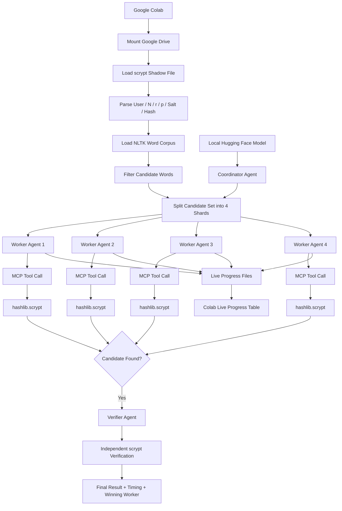

# Agentic AI scrypt Cracking

[](https://m8ven.ai/mcp/ericyoc/agentic_ai_scrypt_cracking_poc?s=readme)

> **Educational use only.**  
> This repository is intended to demonstrate password-hashing concepts, defensive security principles, and the computational impact of password-hardening parameters in a controlled environment. Do not use this code against systems, accounts, hashes, or credentials that you do not own or have explicit authorization to test.

## Overview

This project demonstrates how password hashing can be made deliberately expensive for an attacker by combining:

- **scrypt**, a memory-hard password-based key derivation function
- **salting**, which prevents identical passwords from producing universally reusable hash values
- **configurable cost parameters**, which increase the computational and memory cost of each password guess
- **parallel multi-agent orchestration**, which divides a controlled candidate set among several workers
- **Model Context Protocol (MCP)**, which provides a structured tool interface between the local agents and the Python verification functions
- **live progress reporting**, showing attempts, completion percentage, checks per second, and ETA for each worker

The demonstration uses a local Hugging Face model as the agent layer, Google Colab as the execution environment, Google Drive for persistent storage, and Python's built-in `hashlib.scrypt()` implementation for password verification.

The goal is not simply to recover a password. The larger purpose is to show **why password hashing algorithms are intentionally expensive**, why salts matter, and how changing the cost parameters directly affects the amount of work required for password guessing.

---

## What This Demonstrates

A fast cryptographic hash is usually a poor choice for password storage because an attacker can test an enormous number of guesses very quickly.

Password hashing functions such as bcrypt and scrypt are designed to change that economics.

This demonstration illustrates several defensive principles:

1. **Password verification should be deliberately expensive.**  
   Every candidate password must go through the full scrypt computation before it can be accepted or rejected.

2. **A salt prevents useful precomputation across accounts.**  
   The salt is incorporated into the password derivation process, so the same plaintext password combined with a different salt produces a different derived value.

3. **Work factors control attack cost.**  
   Increasing the work factor increases the resources required for every password attempt, including legitimate verification and malicious guessing.

4. **scrypt adds a memory-cost dimension.**  
   Unlike purely CPU-oriented password hashing, scrypt is designed to require substantial memory as well as computation. This makes large-scale parallel guessing more expensive because an attacker must provide memory for many simultaneous guesses.

5. **Parallelism helps, but it does not eliminate the cost of a strong password hash.**  
   The notebook divides the candidate space among four workers. Each worker evaluates a different non-overlapping shard, but every candidate still requires an independent scrypt computation.

---

## Architecture

The notebook uses six logical agents:

- **1 Coordinator Agent** — establishes and validates the parallel execution plan.
- **4 Worker Agents** — each receives a separate, non-overlapping candidate shard.
- **1 Verifier Agent** — independently validates the candidate returned by the successful worker.

The four workers execute concurrently through MCP.



---

## scrypt Shadow Format

The demonstration reads hashes using the following structure:

```text
User:$scrypt$N$r$p$Salt$Base64Hash
```

Example structure:

```text
Bilbo:$scrypt$16384$8$1$<salt>$<base64-derived-key>
```

The fields are:

| Field | Meaning |
|---|---|
| `User` | Account or user identifier |
| `scrypt` | Password hashing / KDF algorithm |
| `N` | Primary CPU and memory cost parameter |
| `r` | Block-size parameter |
| `p` | Parallelization parameter |
| `Salt` | Value mixed with the plaintext password before derivation |
| `Base64Hash` | Base64-encoded derived key used for verification |

The notebook parses these fields directly and passes the parameters to Python's `hashlib.scrypt()` implementation.

---

## Why the Work Factor Matters

A password hash should be intentionally slow enough that large-scale guessing becomes expensive while normal authentication remains usable.

For scrypt, the primary cost parameters are:

### `N`

`N` is the main work and memory cost parameter.

It must be a power of two. Increasing `N` increases both the computational effort and the memory requirements of each password derivation.

Conceptually:

```text
larger N
   ↓
more computation
   ↓
more memory required
   ↓
fewer password guesses per second
   ↓
higher attack cost
```

### `r`

`r` controls the block size used internally by scrypt and directly influences memory use.

### `p`

`p` controls the internal parallelization factor and increases the total amount of work required.

The practical security idea is straightforward:

> If every password guess costs more CPU time and memory, an attacker can test fewer guesses in the same amount of time and must spend more money on hardware and infrastructure.

The parameters should therefore be selected so that password verification remains acceptable for legitimate users while being expensive at attack scale.

---

## Why Password Salts Matter

A salt is a value combined with the password before the password-hashing function is applied.

Without salts, two users choosing the same password can produce the same stored hash. That allows an attacker to identify password reuse and makes precomputed hash tables much more valuable.

With unique salts:

```text
Password + Salt A → Derived Hash A
Password + Salt B → Derived Hash B
```

Even when the plaintext password is identical, the resulting stored values are different.

Salts provide several important benefits:

- prevent identical passwords from automatically producing identical stored hashes
- make rainbow tables and other precomputed lookup databases far less useful
- force attackers to perform password-guessing work separately for each salted hash
- prevent work performed against one user's hash from automatically transferring to another user

### Production Note

The demonstration preserves the supplied dataset structure for repeatability.

For a real password-storage system, **each password should have its own cryptographically random salt**. Salts are not secret and are normally stored alongside the derived password hash.

The salt protects against precomputation. The work factor protects by making every individual guess expensive. These mechanisms complement each other.

---

## Multi-Agent Candidate Distribution

The notebook builds the candidate list once and then divides it into four non-overlapping shards.

Conceptually:

```text
Complete Candidate Set
        |
        +---- Shard 0 ----> Worker Agent 1
        |
        +---- Shard 1 ----> Worker Agent 2
        |
        +---- Shard 2 ----> Worker Agent 3
        |
        +---- Shard 3 ----> Worker Agent 4
```

Each worker receives a separate candidate file and verifies only the words in its assigned shard.

This avoids four agents performing the same work.

The workers run concurrently, so the overall wall-clock time can be substantially lower than running the same candidate set sequentially. The improvement is still limited by available CPU resources, memory bandwidth, scrypt cost parameters, and runtime overhead.

---

## MCP Tool Flow

Model Context Protocol is used as the structured boundary between the agent layer and the password-verification code.

The worker agents do not directly implement scrypt.

Instead, an agent selects the appropriate MCP tool and supplies its validated parameters:

```text
Worker Agent
     ↓
Validated Tool Request
     ↓
MCP Client
     ↓
MCP Server
     ↓
crack_shard()
     ↓
hashlib.scrypt()
     ↓
Comparison with Stored Derived Key
```

This separation makes the architecture easier to inspect and demonstrates how an AI agent can coordinate deterministic security tooling without replacing the underlying cryptographic implementation.

---

## Live Progress Monitoring

Each worker periodically writes progress information to Google Drive.

The notebook displays a live table containing values such as:

```text
Agent           Status    Attempts    Total      %     checks/s      ETA
Worker-Agent-1  running      8500     33787    25.2      12.4       34m
Worker-Agent-2  running      8250     33786    24.4      12.1       35m
Worker-Agent-3  running      8500     33786    25.2      12.3       34m
Worker-Agent-4  running      8250     33786    24.4      12.0       35m
```

This makes several effects visible:

- the cost of the selected scrypt parameters
- the throughput achieved by each worker
- how evenly the candidate space is distributed
- how parallel workers affect wall-clock time
- how much slower stronger work factors make password guessing

---

## scrypt vs. bcrypt

Both bcrypt and scrypt are designed for password hashing, but they emphasize different defenses.

| Characteristic | bcrypt | scrypt |
|---|---|---|
| Primary design | Deliberately slow password hashing | Memory-hard password-based key derivation |
| Main cost controls | Cost/work factor | `N`, `r`, and `p` |
| CPU cost | Yes | Yes |
| Significant configurable memory cost | Limited | Yes |
| Salt support | Built into bcrypt hash format | Required input to the KDF |
| Parallel attack resistance | Primarily through computational cost | Computational + memory cost |
| Common use | Web application password storage and authentication systems | Password storage/KDF use cases where memory hardness is desired |
| Other notable use | Authentication libraries and frameworks | Key derivation and historically some cryptocurrency proof-of-work designs |

### Where bcrypt is commonly used

bcrypt has been widely adopted for password storage in web applications because it is mature, simple to deploy, and exposes an easy-to-understand cost factor.

It is commonly encountered in:

- web application authentication systems
- server-side password databases
- identity systems built with frameworks or libraries that historically selected bcrypt as their password hasher
- existing systems that increase the bcrypt cost factor over time as hardware becomes faster

A bcrypt hash commonly includes its algorithm version, cost factor, salt, and derived hash in one encoded string.

### Where scrypt is used

scrypt is useful when memory hardness is an important part of the security model.

It is used for:

- password-based key derivation
- password storage systems that explicitly choose scrypt
- encryption systems that derive cryptographic keys from user passwords
- software using cryptographic libraries that expose scrypt as a KDF
- some cryptocurrency designs, historically including proof-of-work systems derived from scrypt

The major architectural difference is that scrypt intentionally requires a configurable amount of memory in addition to CPU effort.

That matters because an attacker attempting millions of guesses in parallel cannot focus only on raw processor speed. The attacker must also provision enough memory and memory bandwidth for those concurrent computations.

---

## Why Memory Hardness Matters

Suppose an attacker wants to run thousands of password guesses simultaneously.

With an algorithm whose dominant cost is computation, the attacker can attempt to scale by adding large numbers of highly parallel processing units.

scrypt deliberately introduces a substantial memory requirement for each derivation.

Conceptually:

```text
Traditional Guessing Cost
CPU × Number of Guesses

scrypt Guessing Cost
CPU + Memory + Memory Bandwidth
        ×
Number of Concurrent Guesses
```

The defender does not need password hashing to be impossible.

The objective is to make the economics unfavorable:

> Make every unauthorized password guess sufficiently expensive that performing millions or billions of guesses becomes costly in time, hardware, memory, power, and infrastructure.

---

## bcrypt Work Factor vs. scrypt Parameters

bcrypt generally expresses its work factor as a logarithmic cost value.

For example, increasing bcrypt's cost from one level to the next approximately doubles the underlying key-setup work.

scrypt exposes its resource controls differently:

```text
bcrypt
    cost

scrypt
    N
    r
    p
```

Because the algorithms are fundamentally different, a bcrypt cost value should not be interpreted as directly equivalent to a particular scrypt `N` value.

A migration or comparison should benchmark the actual runtime and resource usage on the target hardware rather than assuming that similarly numbered parameters provide equivalent security.

---

## Technologies

- Python
- Google Colab
- Google Drive
- Python `hashlib.scrypt`
- NLTK word corpus
- Hugging Face Transformers
- Qwen2.5-0.5B-Instruct
- Model Context Protocol (MCP)
- asyncio
- pandas

---

## Repository Components

Typical project structure:

```text
Task2_Efficient_MultiAgent_Scrypt/
├── inputs/
│   ├── shadow_scrypt.pdf
│   ├── candidates_6_10.txt
│   ├── candidate_shard_0.txt
│   ├── candidate_shard_1.txt
│   ├── candidate_shard_2.txt
│   └── candidate_shard_3.txt
├── models/
│   └── Qwen2.5-0.5B-Instruct/
├── nltk_data/
├── progress/
├── src/
│   └── mcp_server.py
└── results/
    ├── Worker-Agent-1_result.json
    ├── Worker-Agent-2_result.json
    ├── Worker-Agent-3_result.json
    ├── Worker-Agent-4_result.json
    └── efficient_multiagent_first_user_result.json
```

---

## Running the Demonstration

1. Open the notebook in Google Colab.
2. Run the installation and dependency-verification cells.
3. Mount Google Drive.
4. Allow the notebook to download or reuse the NLTK word corpus.
5. Upload the controlled `shadow_scrypt.pdf` dataset when requested.
6. Allow the local Hugging Face model to load.
7. Run the coordinator and worker-planning cells.
8. Start the concurrent MCP worker cell.
9. Monitor the live progress table.
10. Review the verifier output and final timing report.

For reproducible comparisons, keep the candidate corpus, worker count, runtime environment, and password set consistent when changing scrypt parameters.

---

## Security Takeaway

Secure password storage is not about making a hash impossible to compute.

It is about changing the cost of guessing.

A strong password-storage design combines:

```text
Unique Random Salt
        +
Appropriate Password Hash / KDF
        +
Strong Work / Memory Parameters
        +
Strong User Passwords
        ↓
Higher Cost per Unauthorized Guess
```

Salts prevent attackers from cheaply reusing precomputed work across many accounts.

Work factors make every guess slower.

Memory-hard functions such as scrypt add another scarce resource to the attack: memory.

When these controls are configured appropriately, large-scale password guessing becomes significantly more expensive for bad actors while legitimate password verification remains practical.

---

## Ethical Use

This repository is provided **for educational, research, and authorized defensive-security use only**.

Use it only with:

- synthetic password datasets
- hashes that you generated yourself
- systems you own
- environments for which you have explicit permission to perform password-security testing

Do not use the code to access accounts, systems, or credentials without authorization.

The purpose of this demonstration is to improve understanding of password security and to illustrate why properly salted, deliberately expensive password-hashing functions are important defensive controls.

---

## License

This project is licensed under the MIT License. See the [LICENSE](LICENSE) file for the full text.

```text
MIT License

Copyright (c) 2026 Eric Yocam

Permission is hereby granted, free of charge, to any person obtaining a copy
of this software and associated documentation files (the "Software"), to deal
in the Software without restriction, including without limitation the rights
to use, copy, modify, merge, publish, distribute, sublicense, and/or sell
copies of the Software, and to permit persons to whom the Software is
furnished to do so, subject to the following conditions:

The above copyright notice and this permission notice shall be included in all
copies or substantial portions of the Software.

THE SOFTWARE IS PROVIDED "AS IS", WITHOUT WARRANTY OF ANY KIND, EXPRESS OR
IMPLIED, INCLUDING BUT NOT LIMITED TO THE WARRANTIES OF MERCHANTABILITY,
FITNESS FOR A PARTICULAR PURPOSE AND NONINFRINGEMENT. IN NO EVENT SHALL THE
AUTHORS OR COPYRIGHT HOLDERS BE LIABLE FOR ANY CLAIM, DAMAGES OR OTHER
LIABILITY, WHETHER IN AN ACTION OF CONTRACT, TORT OR OTHERWISE, ARISING FROM,
OUT OF OR IN CONNECTION WITH THE SOFTWARE OR THE USE OR OTHER DEALINGS IN THE
SOFTWARE.
```
